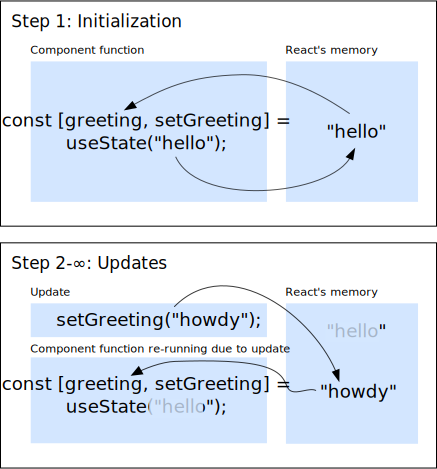

# React

React is a library written in JavaScript that tries to and usually succeeds at making it easier to make interactive web pages. React combines the descriptive markup of HTML, which we examined during our first meeting, with the dynamic code execution that we saw in our Python lesson, so i'm going to have to assume some background coding knowledge from you to avoid doing those lessons again at 3x speed. While you are all going to this web editor link: https://hacksu.com/react , I am going to briefly explain how React makes coding simpler.

Let's look at [this checkout form](https://hacksu.github.io/react-tutorial/checkout-example/checkout-js.html), \[note to presenter: go to that site and show them these things] which I created using just the tools from our first lesson (HTML, CSS, and JavaScript.) The idea is that you can pay for a purchase at Mitch Mart using any combination of these three payment options: your existing account credit, a new credit card, or just trust me bro, come on, I'll pay you back, just trust me. If you're using an existing account, the login part is enabled; if you're entering a new card, the new card part is enabled, but if you're playing the bro card, you never need to enter anything.

So it's very simple to state the logic of when each form field should be enabled. The login fields should be enabled if the first checkbox is checked and the third one isn't; and the new card fields should be enabled if the second checkbox is checked and the third one isn't. Does that logic make sense to everyone?

So, in JavaScript, the thing that makes pages interactive are event listeners, which are functions that are automatically called when the user interacts with something on the page. To implement the functionality we have here, we basically have to write three event listeners - one for each checkbox - and they have to make changes to keep the page logically consistent. The event listener for the "existing account" checkbox has to enable or disable the login fields, but to know if it's allowed to enable them, it has to find the "trust me bro" checkbox using its ID or something similar and see if that is checked, because it's not allowed to enable these fields if it is. The event listener for the "new card" checkbox has to do the same thing; it has to look at the "trust me bro" checkbox to decide if it's allowed to enable the card form. And while the "trust me bro" checkbox's event listener has a really simple job to do when it gets checked (it just disables everything), when it gets unchecked, it has to retrieve the other two checkboxes and then enable the form fields that correspond to them only if they say so.

So, in short, we have three different event listener functions, they have to find and read from these other checkbox elements to find out what changes they need to make to the page, and the rules they have to follow to enforce our simple rules take some thinking about. We've gone from simple logic that I could get you all agree on to a long description that you'd probably want to double-check. Now let's visit [the version of this form that I made with React](https://hacksu.github.io/react-tutorial/checkout-example/checkout-react.html) [it's also linked at the bottom of the vanilla JS version] and see what's different.

The functionality of this page is exactly the same. The first difference in the implementation is that generally, in the world of React, you have variables that store the state of the page, which you can use in your code directly. Without React, you have to run code the find the checkboxes to read out whether they're checked or not when you're figuring out whether to disable or enable form fields. With React, you can easily use these variables that I am basically printing out here so that you can see them. Right now, since none of the checkboxes are checked, they're all storing "false".

And for the second difference, let's see what React does when we change whether a checkbox is checked.

So, yeah. Instead of having three fiddly little event listeners that update the page over time, when a state variable changes in React, there's an explosion and the form is rebuilt from scratch. That's a bit of a simplification, there's some reuse of stuff, but the idea is: you only have to write one function, which will create your form, and it will automatically be re-run [toggle checkbox] when something changes. in that function, you can just use that simple logic we started with when creating these elements. You can make these fields enabled if the login variable is true and the trust me variable is false, and these enabled if the new card variable is true and the trust me variable is false.

Only having to write one function, and re-running it to remake the page when variables change, makes things simpler. And conveniently, React will take care of re-running the function; all we have to do is write the content and use the variables.

Let's go to codepen and do that.

\~~then, i gave up on writing complete paragraphs~~

(again, http://hacksu.com/react, or https://codepen.io/tobeofuse/pen/MWBqqPX?editors=1010 )

```css
* {
  font-family: sans-serif;
}
p, h4 {
  margin: 0;
}
button {
  margin: 10px 0;
}
div {
  text-align: center;
  border: 1px solid black;
  padding: 5px;
  display: inline-block;
}
```

```javascript
// boring template stuff:

import React, { useState } from "https://esm.sh/react@18.2.0?dev";
import { createRoot } from "https://esm.sh/react-dom@18.2.0/client?dev";
import useFetch from "https://esm.sh/react-fetch-hook@1.9.5?dev";

const rootElement = document.querySelector("body");
const component = React.createElement(MyComponent);
createRoot(rootElement).render(component);

function MyComponent(){
  // create content here:
  
}
```

- btw, while on codepen, try not to refresh or close the page, or you will lose your progress, unless you're signed into a codepen account and can thus save things.

- so we're starting with a basic template here. don't worry too much about this code because like i said, it's a standard template. (don't even think about the css; it'll get used later.) but, it first uses import statements to give you access to variables that are declared in the react code located at those URLs; then, it makes use of some of them and makes the react code start updating the page based on the output of a function called MyComponent.

- so we need to write the code that goes in MyComponent, and make it return (output) the stuff we want on our page. a function is a reusable segment of code that probably contains some local variables; in react, a "component" is a reusable set of html elements whose contents are determined by a set of variables. so you can see how these things go together. when we write this function, in the language of React, we're really "creating a component".

- let's do the simplest version of that now.

```jsx
return <p>Hello, world</p>;
```

- we are using an extension to javascript called jsx that lets you create and use html elements in javascript code exactly as you would use numbers or strings or other data types. this syntax is not technically 100% tied to react, but it's very convenient to use it here. in jsx, if you just write a start tag, some content, and an end tag, you get an html element, just like how in most programming languages, if you type a quotation mark, some text, and then another quotation mark, you get a string.

- so does everyone see the hello, world? is codepen, like, working? and is everyone processing what we're doing here? bc i guess this looks kind of weird.

- okay great. the next thing we're going to do is create a variable and use it so we can see how to integrate variables into our html elements.

- first we're going to declare a variable called greeting. to declare a variable in javascript, you can use the keyword "let"; so this will become

```js
let greeting = "Hello, world";
```

- then, we can use it in our html element just by enclosing the variable name in curly braces:

```jsx
return <p>{greeting}</p>;
```

- so, now we're creating an html element and incorporating the value of a variable. go us. if you want, you can change this string in the code and see how the result changes. however, to make a real web page, we're going to need to have a way to change the value based on something the user does; we need something the user can click, like a button or something. also, if we're doing that, we do have to update the variables in a way that prompts the react library code that's running in the background to update the page.

- let's handle that first problem first. we need to create both a variable and a way to update it. this can be done with the react-provided function "use state". this involves more weird syntax.

```js
// replaces first variable declaration
const [greeting, setGreeting] = useState("Hello, world");
```

- while you copy that down: this is the intricate clockwork part of react. react updates the page over and over again by running this function over and over again. however, normally, variables get reset to their initial values when functions get re-run. if we updated our "place" variable just by saying, like, `greeting="buongiorno"`, it wouldn't update things properly; because to create the updated version of this page, the function needs to be re-run, and every time this function runs, place gets set to "world" by that line of code. so it would never output anything containing "buongiorno" in the return value down here. that's the most basic reason why we can't update our variables the normal way and have our page update.

- so, the values of our variables actually need to be stored outside of our component-creating function, and react will do this for us. we have all the tools we need for that on this line of code here (the one with "useState".)

- we are calling the function "useState" and giving it the input string "Hello, world". that input defines the initial value for our "greeting" variable.

- then, later, we can call the function setGreeting to update the value to something other than "Hello". after that, when this function re-runs, and this new line of code executes, greeting will be updated to its latest version by the return value of useState.



- so, this overall situation might sound tricky, but if you understand it even a little, the actual code we need to write will seem pretty simple. first, let's create a button under our paragraph.

```html
<button>Translate</button>
```

- when we have multiple HTML elements in a row, we need to group them, kind of like how you group strings and numbers into arrays when you want to treat multiple of them as a single thing. to do that in jsx, we put an empty start tag before and an empty close tag after the elements we have. so, our return statement will look like this:

```jsx
return <>
    <p>{greeting}</p>
    <button>Translate</button>
  </>;
```

- to add code that will run when the button is clicked, we have to add an onClick attribute. because its value contains javascript code, this attribute will need to use curly braces instead of quotation marks. (for normal html attributes, you would still use quotation marks; if you don't know what those are, don't worry about it.)

```jsx
return <>
    <p>{greeting}</p>
    <button onClick={}>Translate</button>
  </>;
```

- inside the curly braces, we can put the code we want to run when the button is clicked. i'm thinking something like `setGreeting("bonjour le monde")`. we can't just put that in the curly braces, though, because that constitutes calling the function in our code and the greeting will be set to bonjour immediately, instead of that happening when the user clicks the button.

- to fix this, we just have to add the characters `()=>` right in front of the call to setGreeting. the resulting construct is called an arrow function; and this is what you do when you want to store a function call in your code for later instead of making it happen immediately. (it's actually basically the same thing as a lambda function from Python, Java, or C++.)

- so do that. our completed function will look like this:

```jsx
function MyComponent(){
  // create elements here:
  const [greeting, setGreeting] = useState("Hello, world");
  return <>
    <p>{greeting}</p>
    <button onClick={()=>setGreeting("Bonjour le monde")}>
      Translate
    </button>
  </>;
}
```

- so yeah. you thought you came here to learn javascript, but you're actually learning french. this is pretty much as simple as a react app gets. i will now pause so that everyone can catch up, ask questions, or opine that this code looks weird.

- this is a lot of different kinds of punctuation in one place.

- the problem with doing a react app example is that, for a hello-world type example, using normal javascript event listeners is probably simpler? there's a reasonable amount of behind the scenes stuff that we had to go over to get this simple app. but the extra tools pay off when it comes to larger examples, i promise. that's why i had to show you one at the beginning of this. anyway. let's do one more fun thing with this basic example before we move on to something more interesting.

- in this boilerplate code at the top, i told react to update the page based on the component/function called MyComponent; so the entire page will be based on what the function MyComponent returns. but i think the page can have more stuff than this. let's rename our function so it no longer comprises the entire contents of the page; i'll call it MyGreeting.

- then, we'll define a new MyComponent. it will be quite simple:

```jsx
function MyComponent(){
  return <>
    <MyGreeting />
    <MyGreeting />
    <MyGreeting />
  </>;
}
```

- so. react enables us to reuse our function component over and over again. each instance of it acts independently; clicking the button in one does not affect the variables in the other. this is a very important and useful feature of react that basically justifies its existence. it's kind of weird to use in this case, but we're going to get to do something useful with it.

- now that we've got the basics down, let's reopen the codepen in a new tab, and do something more fun and interesting.

```jsx
function MyComponent(){
  let myPokemon = {
    name: "pikachu",
    id: 25,
    height: 4,
    weight: 60,
    sprites: {
      front_default: "https://hacksu.com/pika.png"
    }
  };
}
```

- so. here, we are creating a javascript object. objects are useful because they organize data. think about it like this:

- when you make a normal variable, you're basically adding an entry to a table. this imaginary table has one column for variable names and one column for the values these variables store. when you use a variable, you're asking the computer to find its name on the left side of this table and then either use or modify the value on its right.

- when you create an object, you're basically creating an additional table, where extra values are stored under a different set of names. in javascript, you can create an object by just writing a list of name and value pairs within curly braces. a colon separates the name and the value, and commas separate the pairs.

- so if we create this object called myPokemon, we're storing all these values in a separate table. we can also put an object in our object, as i'm doing here with "sprites". that creates yet another table.

- so, to use a normal variable, you just write its name; to use data from inside an object's table, use the object's name, then a dot, then the name the data has inside the object's table; and if that data is itself another object, just repeat the procedure.

- zoom in on this and scroll over it left to right.


- now we can make a React component that displays the data stored in this object. so, yeah, this is basically just HTML, just using data from the object inside curly braces.

- first, we'll make a header containing the pokemon's id and name. then, we'll add the image for it. you might be used to writing the image source attribute with quotes in normal HTML, but because we want to use a javascript expression as the source, we have to use curly braces instead. then, i'll make a paragraph that includes the height and weight.

```jsx
return <div className="pokedexEntry">
      <h4>#{data.id} - {data.name}</h4>
      
      <p>Height: {data.height}, Weight: {data.weight}</p>
    </div>;
```

- this works, but it's a little bit ugly. i'm going to write some css to fix it. you can follow along, or, honestly, i'm just going to post the code in the discord and you can copy paste it. this isn't a css lesson.

```css
* {
  font-family: sans-serif;
  margin: 0;
}

.pokedexEntry {
  text-align: center;
  border: 1px solid black;
  padding: 5px;
  display: inline-block;
}
```

- i'm first selecting all the elements and changing the font to look less weird and old. i'm also removing all the margins on everything to make stuff less spread out. then, i'm selecting the div that contains our pokemon data specifically, centering the text, adding a border, adding some padding along the inside edge of the div, and setting the display mode to inline-block so it doesn't take up the whole width of the page. splendid.

- so. in our hello world example, we used useState to make our component change over time. this time, we're going to use another react hook, called useFetch.

- react hooks are functions that give you access to react's data and let you receive updates from it. their names start with "use". we've already seen one of react's built-in hooks, "useState"; it let us store a variable in react's memory, and it also gave us a way to receive updates about that variable from it.

- useFetch has different functionality, but still deals with triggering changes to the component: useFetch will ask the browser to retrieve a javascript object from a url and then trigger our component function to be re-run once that object loads. behind the scenes, it's actually using useState to manage variables; it is a custom hook that someone created, which just means that it's a function that secretly contains one or many of react's basic built-in hooks.

- believe it or not, there really are javascript objects that can be found by going to urls on the internet. a website that makes data available in a machine-readable form at certain urls is one of the many things that can be called an application programming interface, or API. a lot of apis require you to make an account and have login credentials and stuff, but one that doesn't is the pokemon api located at pokeapi.com. from this api, we can freely retrieve an object that stores the data of any pokemon based on its name or id. we can then use our existing code to display it.

- call useFetch like this:

```jsx
const {isLoading, data} = useFetch("https://pokeapi.co/api/v2/pokemon/bulbasaur");
```

- you might notice that when useState returned its two variables, we captured them with square brackets, but here, we're using curly braces. this is because useState returns an array of two values, and you use square brackets to get variables in order from a list; on the other hand, useFetch returns an object of named values, and we use curly braces to get variables out of objects by their name. any function, including react hooks, can use either of those methods to return multiple things; you just have to know or ideally find an example showing which one is happening.

- you can go to that url to see all the data in the object that's available there, but we're just going to use the members we've already been using. to switch over to the new pokemon data that this call gave us, we can just store it under our old variable name like this:

```js
myPokemon = data;
```

- but, there is one problem. we need to figure out what to do when that object from that url hasn't loaded yet. isLoading will inform us whether it has or hasn't loaded; we can use a simple if statement to change this function's behavior if it hasn't.

```jsx
if (isLoading) {
  return <p>Loading...</p>;
}
```

- now our code will work. all we had to do is stop it from getting to the point where it attempted to read data from this object when the object hadn't actually loaded yet; when this return statement runs, the function will end before it gets to that stuff. aside from just using variables within the jsx like we've been doing, this is another way to change what a component looks like based on the data in the function; it's called conditional rendering.

- so, the main advantage to using this api instead of making our own objects is that now we can get data for any pokemon instantly. if we change the url that we're passing to useFetch, we can get the pokemon corresponding to a different id. we can also actually use a pokemon's name or id to get a specific pokemon.

- now we can do the same thing we did earlier and display multiple pokemon. let's change the name of this function to something else, like PokemonComponent, and then use it a bunch of times in a MyComponent function:

```jsx
function MyComponent(){
  return <>
    <PokemonComponent />
    <PokemonComponent />
    <PokemonComponent />
  <>;
}
```

- well. there's one problem. this method gives us the potential for infinite bulbasaurs, but it would be nice to change what pokemon each of these things displays.

- fortunately, it turns out that just like functions can take arguments as input when they need to output something different based on when and where they are called, function components can take input as well. these inputs are called "props". let's add a couple things to our PokemonComponent function to change its behavior based on a prop called pokeID.

- first, we add an input argument to its declaration:

```jsx
function PokemonComponent(props){
```

- and props is actually an object. so let's assume it has a member called "whichGuy" and use it to determine the URL that we will fetch our pokemon object from:

```jsx
const {isLoading, data} = useFetch(
    "https://pokeapi.co/api/v2/pokemon/"+props.whichGuy
  );
```

- now, all we have to do is modify our MyComponent function to pass a prop into the PokemonComponents it returns. this is how you do that:

```jsx
function MyComponent(){
  return <>
    <PokemonComponent whichGuy="pikachu" />
    <PokemonComponent whichGuy="wartortle" />
    <PokemonComponent whichGuy="bulbasaur" />
  <>;
}
```

- the possibilities from here are endless. since the pokeapi also accepts ids when specifying which pokemon you want to load, we could use a for loop to load a whole bunch of them; we could also use useFetch again to get a list of all pokemon names from the api and then search through them to figure out which ones to render. we could display more stats, we could add more pictures from the sprites object, and we could do our best to develop a function that puts little hats on all of them. but we've already done a lot since we started here looking at mitch mart, and it's up to you to take the next steps. goodbye.
